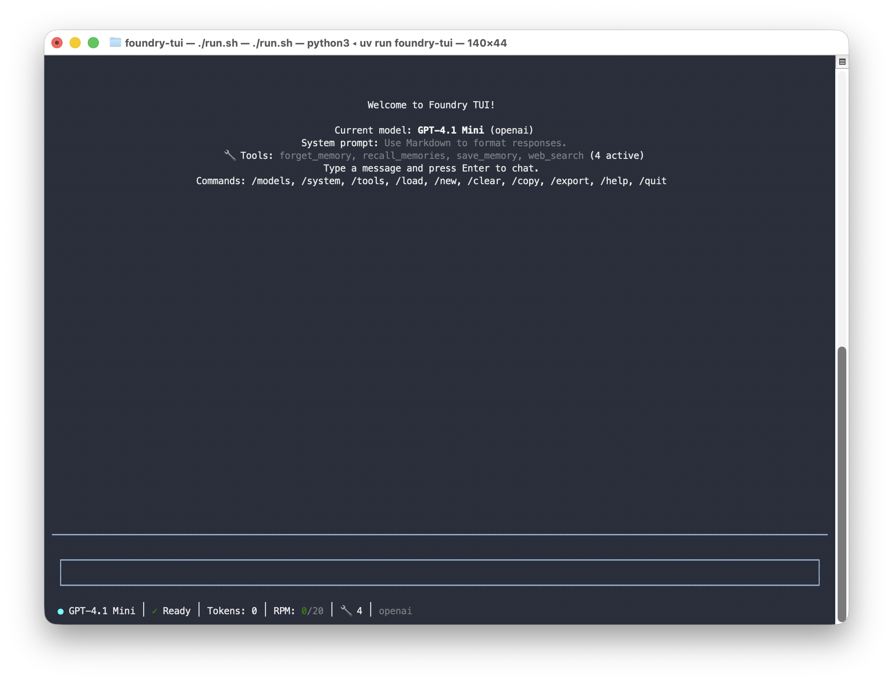
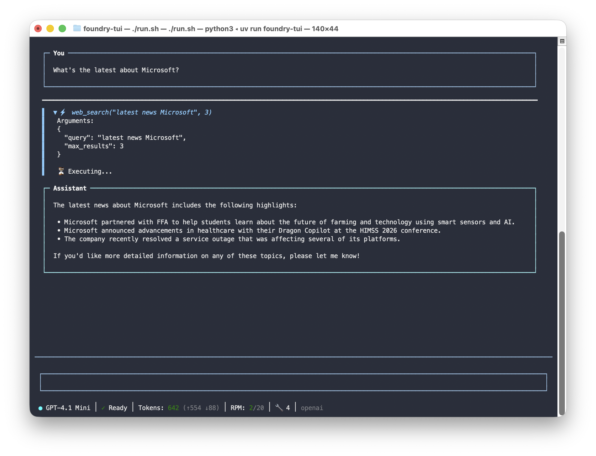
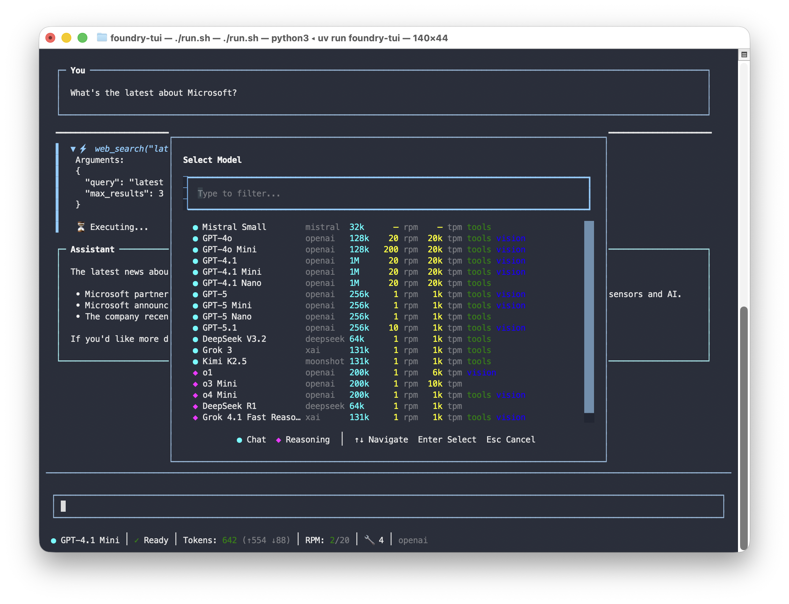

# Foundry TUI

A polished terminal-based chat application for testing AI models on Microsoft Azure AI Foundry. Features streaming responses, tool calling, persistent memory with semantic search, and 20 color themes — all in a Claude Code-inspired TUI.



## Features

- **Multi-Model Support** - Chat with 18+ models from OpenAI, DeepSeek, xAI, Mistral, and more
- **Streaming Responses** - Real-time token streaming with animated status
- **Model Picker** - Fuzzy search to quickly switch between models
- **Tool Calling** - Web search, file creation, memory recall; extensible tool registry
- **Memory** - Persistent user context across sessions; models recall facts on demand via tool calling with semantic search
- **Clickable Links** - URLs in assistant responses open in your browser; file paths open in Finder/Explorer
- **20 Color Themes** - Nord default, switch with `/theme` (Dracula, Tokyo Night, Gruvbox, etc.)
- **Reasoning Display** - `<think>` tokens from reasoning models shown in collapsible widgets
- **Rate Limit Tracking** - RPM/TPM display, auto-retry on 429 with countdown
- **Command Autocomplete** - Tab completion for all slash commands
- **Input History** - Up/Down arrow to cycle through previous prompts
- **Conversation History** - Auto-save and resume previous conversations
- **System Prompts** - Set custom system prompts, persisted across sessions
- **Markdown Rendering** - Rich formatting with syntax-highlighted code blocks
- **Token Tracking** - Real token counts with prompt/completion/cached breakdown

## Quick Start

### Prerequisites

- **Python 3.11+**
- **[uv](https://github.com/astral-sh/uv)** - Fast Python package manager
- **Azure subscription** with AI services access

### Installation

```bash
# Clone the repository
git clone https://github.com/svanvliet/foundry-tui.git
cd foundry-tui

# Install uv (if not already installed)
curl -LsSf https://astral.sh/uv/install.sh | sh

# Run the app (uv handles dependencies automatically)
./run.sh
```

### Configure Azure (Option A: Automated Setup)

Run the interactive setup script to deploy Azure resources:

```bash
# macOS/Linux
./scripts/setup.sh

# Windows (PowerShell)
.\scripts\setup.ps1
```

The script will:
1. Check prerequisites (Azure CLI)
2. Create a resource group
3. Let you select which models to deploy
4. Deploy Azure OpenAI and/or Azure AI Services
5. Deploy `text-embedding-3-small` for semantic memory search
6. Automatically configure your `.env` file

### Configure Azure (Option B: Manual Setup)

1. Copy the example environment file:
   ```bash
   cp .env.example .env
   ```

2. Fill in your Azure credentials in `.env`:
   ```bash
   # Azure OpenAI (for GPT and o-series models)
   AZURE_OPENAI_ENDPOINT=https://your-region.api.cognitive.microsoft.com/
   AZURE_OPENAI_API_KEY=your-key-here

   # Azure AI Services (for DeepSeek, Grok, Kimi)
   AZURE_AI_ENDPOINT=https://your-region.api.cognitive.microsoft.com/
   AZURE_AI_API_KEY=your-key-here

   # Optional: enables semantic memory search
   AZURE_OPENAI_EMBEDDING_DEPLOYMENT=text-embedding-3-small
   ```

3. Run the app:
   ```bash
   ./run.sh
   ```

## Usage

### Commands

| Command | Description |
|---------|-------------|
| `/models` or `/m` | Open model picker (fuzzy search) |
| `/system [prompt]` | View/set system prompt (`/system clear` to remove) |
| `/theme [name]` | Switch color theme (20 built-in themes) |
| `/tools` | List registered tools (`/tools info <name>` for details) |
| `/memory` | List stored memories |
| `/memory search <query>` | Search memories |
| `/memory delete <id>` | Delete a memory |
| `/memory clear` | Clear all memories |
| `/load` or `/convs` | Browse and load saved conversations |
| `/save [title]` | Save conversation with optional title |
| `/new` or `/n` | Start a new conversation |
| `/clear` or `/c` | Clear chat history |
| `/copy` | Copy last response to clipboard |
| `/export [file]` | Export conversation to JSON |
| `/state [on\|off]` | Toggle server-side conversation state |
| `/help` or `/h` | Show help |
| `/quit` or `/q` | Exit |


*Chat with streaming responses and tool calling*

### Keyboard Shortcuts

| Shortcut | Action |
|----------|--------|
| `Enter` | Send message |
| `Shift+Enter` | New line in input |
| `Up/Down` | Cycle through input history |
| `Tab` | Accept slash command autocomplete |
| `Escape` | Cancel streaming / retry / close picker |
| `Ctrl+C` | Quit (also works during retry countdown) |
| `Ctrl+L` | Clear screen |

### Built-in Tools

Models with tool calling support can use these built-in tools:

| Tool | Description | Config Required |
|------|-------------|-----------------|
| `web_search` | Search the web (Tavily for non-OpenAI models; OpenAI uses built-in `web_search_preview`) | `TAVILY_API_KEY` for non-OpenAI |
| `save_memory` | Save a fact about the user for future recall | None |
| `recall_memories` | Search saved memories (semantic search with embeddings if configured) | None (embeddings optional) |
| `forget_memory` | Delete a specific memory by ID | None |
| `create_file` | Create a text file in `~/Downloads/` | None |

**File creation security**: Files are sandboxed to `~/Downloads/` only. Path traversal is blocked, binary executables (.exe, .dll, .so) are rejected, and a 10 MB size limit is enforced. Duplicate filenames are auto-suffixed (`report_1.md`, `report_2.md`, etc.).

**Clickable links**: URLs in assistant responses are clickable — they open in your default browser. File paths from `create_file` can also be clicked to open in Finder/Explorer.

Use `/tools` to see registered tools and `/tools info <name>` for parameter details.

### Supported Models


*Fuzzy model picker with 18+ models*

**Azure OpenAI:**
- GPT-4o, GPT-4o Mini
- GPT-4.1, GPT-4.1 Mini, GPT-4.1 Nano
- GPT-5, GPT-5 Mini, GPT-5 Nano, GPT-5.1
- o1, o3-mini, o4-mini (reasoning)

**Azure AI Services:**
- DeepSeek R1 (reasoning), DeepSeek V3 (chat)
- Grok 3, Grok 4.1 Fast Reasoning
- Kimi K2.5

**Serverless:**
- Mistral Small

> Azure OpenAI models use the Responses API with built-in web search. Azure AI and Serverless models use the Chat Completions API.

## Project Structure

```
foundry-tui/
├── run.sh                 # Quick start script
├── .env.example           # Environment template
├── models-catalog.json    # Model definitions
├── scripts/
│   ├── setup.sh           # Azure resource setup (Bash)
│   ├── setup.ps1          # Azure resource setup (PowerShell)
│   ├── teardown.sh        # Resource cleanup (Bash)
│   └── teardown.ps1       # Resource cleanup (PowerShell)
├── src/foundry_tui/
│   ├── app.py             # Main application
│   ├── config.py          # Configuration loading
│   ├── models.py          # Model definitions
│   ├── api/               # API clients
│   ├── tools/             # Tool calling (web search, memory)
│   ├── ui/                # TUI components
│   └── storage/           # Persistence
└── docs/
    ├── requirements.md    # Full requirements
    └── plan.md            # Implementation plan
```

## Configuration

### Environment Variables

| Variable | Description | Required |
|----------|-------------|----------|
| `AZURE_OPENAI_ENDPOINT` | Azure OpenAI endpoint URL | For GPT/o-series |
| `AZURE_OPENAI_API_KEY` | Azure OpenAI API key | For GPT/o-series |
| `AZURE_OPENAI_API_VERSION` | API version (default: `2024-12-01-preview`) | No |
| `AZURE_OPENAI_EMBEDDING_DEPLOYMENT` | Embedding model deployment name (enables semantic memory search) | No |
| `AZURE_AI_ENDPOINT` | Azure AI Services endpoint | For DeepSeek/Grok/Kimi |
| `AZURE_AI_API_KEY` | Azure AI Services API key | For DeepSeek/Grok/Kimi |
| `SERVERLESS_ENDPOINT_*` | Serverless model endpoints | For Mistral |
| `SERVERLESS_KEY_*` | Serverless model API keys | For Mistral |
| `TAVILY_API_KEY` | Tavily web search API key ([free tier](https://tavily.com)). Only needed for non-OpenAI models (OpenAI models use built-in web search) | For tool calling |
| `FOUNDRY_TUI_LOG_LEVEL` | Log level (default: `INFO`) | No |
| `FOUNDRY_TUI_COST_WARNING_THRESHOLD` | Token warning threshold | No |

### Model Catalog

Models are defined in `models-catalog.json`. You can add, remove, or modify models by editing this file. Each model specifies:

- `id` - Unique identifier
- `name` - Display name
- `provider` - Provider name (openai, deepseek, xai, etc.)
- `category` - `chat` or `reasoning`
- `deployment` - API type and deployment details
- `capabilities` - Tools, streaming, vision support
- `context_window` - Maximum context size
- `max_output_tokens` - Maximum output length

## Data Storage

Foundry TUI stores data in `~/.foundry-tui/`:

- `config.json` - User preferences (last model, system prompt, theme, rate limits)
- `conversations/` - Saved conversations (JSON)
- `input_history.txt` - Command/prompt history (last 200 entries)
- `memories.md` - Persistent memory (human-readable Markdown)
- `memory_embeddings.json` - Embedding vectors for semantic search

Logs are written to `logs/` in the project directory.

## Cleanup

To remove Azure resources created by the setup script:

```bash
# macOS/Linux
./scripts/teardown.sh

# Windows (PowerShell)
.\scripts\teardown.ps1
```

## Development

```bash
# Install development dependencies
uv sync --dev

# Run tests
uv run pytest

# Run linter
uv run ruff check .

# Run type checker
uv run pyright
```

## Troubleshooting

### "max_tokens is too large" error
The app no longer sends max_tokens by default. If you see this error, make sure you have the latest version.

### Model not responding
1. Check your `.env` file has the correct endpoint and API key
2. Verify the model is deployed in your Azure subscription
3. Check `logs/` for detailed error messages

### 429 Rate Limit Errors
Azure S0 tier has hard rate limit caps (e.g., 1K TPM on newer models like GPT-5.1) that override your deployment capacity settings. The app auto-retries with a countdown (up to 3 attempts). Press Escape to cancel the retry or Ctrl+C to quit. Check your actual limits in the Azure portal under your deployment's rate limits tab.

### Web search not working on OpenAI models
OpenAI models use the built-in `web_search_preview` tool via the Responses API. No Tavily API key needed. If you see errors, ensure your Azure OpenAI API supports `api-version=2025-03-01-preview` or later.

### Memory search not finding results
If `AZURE_OPENAI_EMBEDDING_DEPLOYMENT` is not set, memory recall uses keyword substring matching. Set this env var and run the setup script to enable semantic search (finds "name" when memory says "Scott lives in San Clemente").

## License

MIT

## Acknowledgments

- Built with [Textual](https://textual.textualize.io/) for the TUI
- Inspired by [Claude Code](https://claude.ai/claude-code)'s clean interface
- Uses [Rich](https://rich.readthedocs.io/) for markdown rendering
